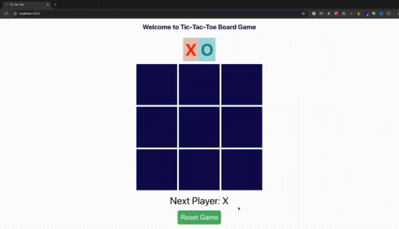

# Tic-Tac-Toe 🎮

A simple Tic-Tac-Toe game built with React.



## 🚀 Getting Started

### Installation
1. Clone the repository:
    ```sh
   git clone https://github.com/Ploynpk/tic-tac-toe.git
    ```

2. Navigate to the project directory:

    ```sh
    cd tic-tac-toe
    ```

3. Install dependencies:

    ```sh
    npm install
    ```

4. Start the development server:
    ```sh
    npm start
    ```
